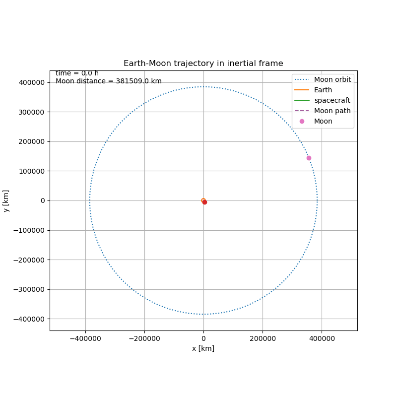
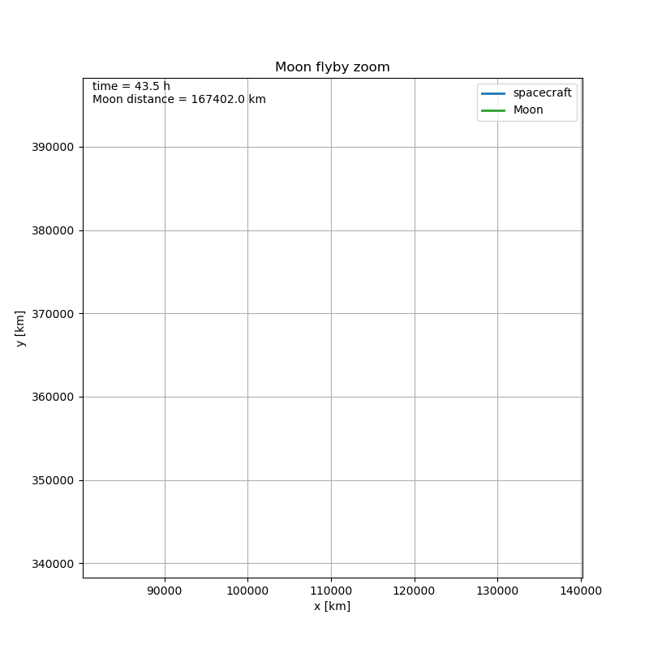
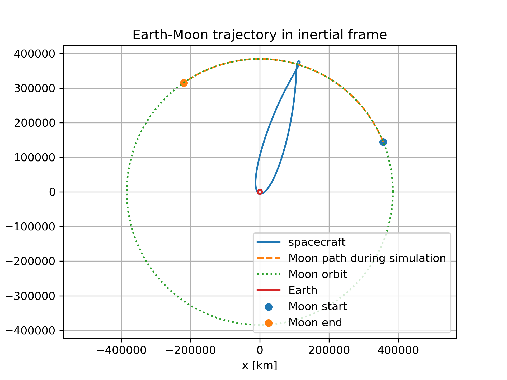
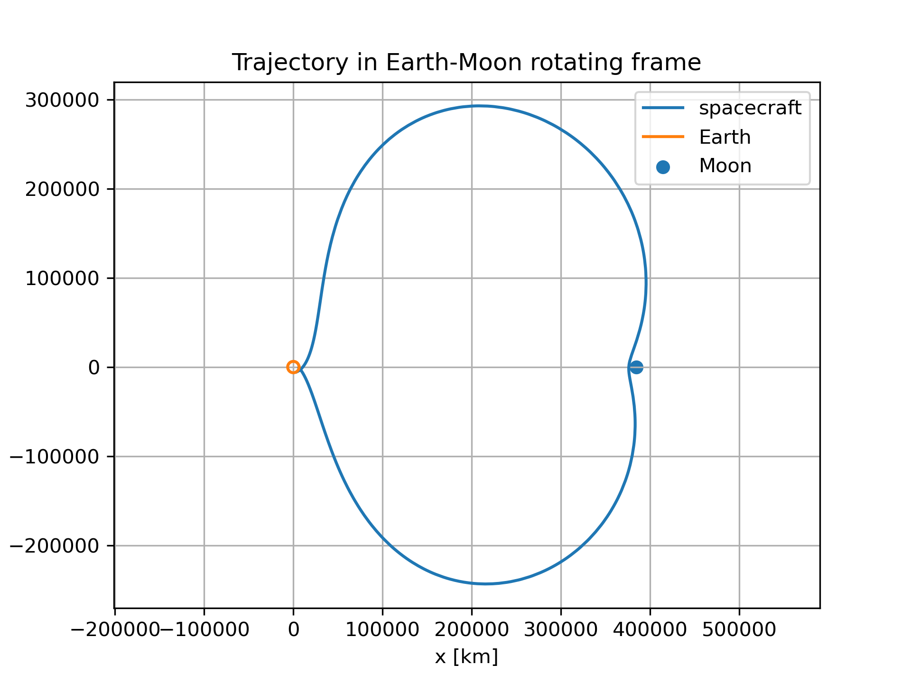
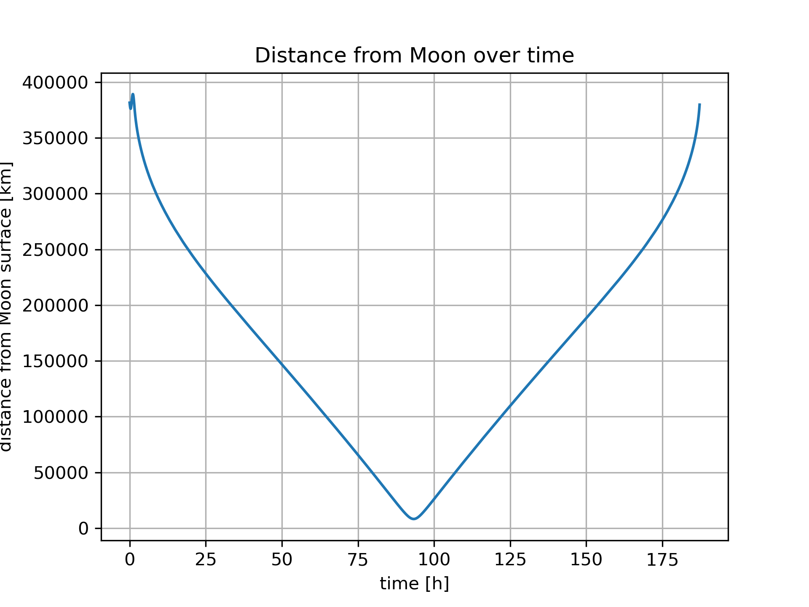

# Moon Mission Simulator

A simplified C++ simulation of an Earth-Moon free-return trajectory.

The goal of this project was to build a small numerical physics simulator that shows how a spacecraft can travel from Earth to the Moon and return back to Earth. The simulation is not meant to be a real mission-planning tool. It is a student project focused on orbital mechanics, numerical integration and clean scientific programming.

## Preview

### Mission animation



### Moon flyby zoomed



### Earth-Moon trajectory



### Rotating frame view



### Distance from the Moon



## What the Project Does

The program simulates the motion of a spacecraft in a simplified 2D Earth-Moon system.

The current version includes:

- Earth and Moon gravity,
- a moving Moon on a circular orbit,
- an Earth-centered frame with an indirect acceleration correction,
- fourth-order Runge-Kutta integration,
- a simple trajectory search for initial conditions,
- output files with trajectory data and mission summary,
- Python plots and GIF animations.

## Physical Model

The spacecraft is treated as a point mass. Its motion is calculated from Newtonian gravity.

The gravitational acceleration has the form:

```txt
a = -G M r / |r|^3
```

The Moon is modeled as moving on a circular orbit around Earth:

```txt
x_moon = d cos(omega t + phase)
y_moon = d sin(omega t + phase)
```

where `d` is the average Earth-Moon distance and `omega` is the Moon's angular velocity.

Because the simulation is written in an Earth-centered frame, an indirect acceleration term is added. This corrects for the fact that the Moon also pulls on Earth.

## Numerical Method

The equations of motion are solved using the classical fourth-order Runge-Kutta method.

The state vector is:

```txt
x, y      position
vx, vy    velocity
m         mass
```

For the main coast phase, the spacecraft mass is treated as constant.

## Mission Setup

The selected simulation uses a simplified mission sequence:

```txt
parking orbit → impulsive TLI burn → Earth-Moon coast → Moon flyby → Earth return
```

The burn is modeled as an instant velocity change, not as a real finite-duration engine burn.

Final selected parameters:

```txt
parking orbit altitude: 200 km
parking orbit period: 88.35 min
Moon phase at TLI: 0.4 rad
TLI speed: 10930 m/s
gamma: 0.375 rad
```

## Mission Summary

For the selected trajectory, the simulation produced:

```txt
closest Moon approach: 8248.67 km
time of closest Moon approach: 93.32 h
maximum Earth altitude: 388020 km
return time: 187.23 h
return velocity: 10.98 km/s
```

These values are from the simplified model, so they should be treated as simulation results, not as real mission data.

## Trajectory Search

The initial conditions were selected using a simple parameter search.

The search tested different values of:

```txt
Moon phase
initial position angle
initial velocity magnitude
initial velocity direction
```

The objective was to find a trajectory that:

- passes close to the Moon,
- returns close to Earth,
- keeps a clean free-return-like shape,
- avoids impact with the Moon or Earth.

This is not an advanced optimizer, but it is enough to find a good trajectory for this simplified model.

## Project Structure

```txt
src/
├── constants.h
├── state.h
├── physics.h
├── physics.cpp
├── integrator.h
├── integrator.cpp
├── main.cpp
└── search.cpp

plots/
├── plot.py
├── animate.py
├── flight_inertial.gif
├── flight_rotating.gif
├── trajectory_inertial.png
├── trajectory_rotating.png
├── moon_distance.png
├── altitude.png
└── velocity.png

results/
├── trajectory.txt
├── summary.txt
└── search_best.txt
```

## Build and Run

Compile the main simulation:

```bash
g++ src/main.cpp src/physics.cpp src/integrator.cpp -o moon.exe
```

Run it:

```bash
./moon.exe
```

Generate plots:

```bash
python plots/plot.py
```

Generate GIF animations:

```bash
python plots/animate.py
```

Run the trajectory search:

```bash
g++ src/search.cpp src/physics.cpp src/integrator.cpp -o search.exe
./search.exe
```

## Output Data

The main simulation writes trajectory data to:

```txt
results/trajectory.txt
```

The columns are:

```txt
t x y vx vy m altitude velocity moon_x moon_y distance_moon
```

A short mission summary is saved to:

```txt
results/summary.txt
```

## Limitations

This project is intentionally simplified.

Main limitations:

- 2D motion only,
- circular Moon orbit,
- no Sun gravity,
- no atmosphere,
- no real ephemeris data,
- no finite engine burn model,
- simplified spacecraft model,
- simplified trajectory search.

Because of this, the results are useful for learning and visualization, but not for real mission design.

## Future Improvements

Possible future improvements:

- adding Sun gravity,
- using the real Moon ephemeris data,
- improving the trajectory optimizer,
- adding a better TLI burn model,
- comparing different integration time steps,
- adding an interactive visualization,
- exporting more mission statistics.

## Technologies

```txt
C++
Python
NumPy
Matplotlib
Numerical Methods
Orbital Mechanics
```

## Author

Patryk Kuna
